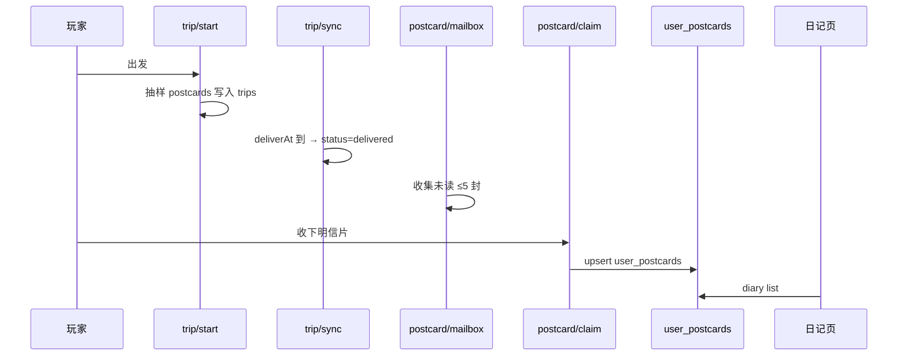
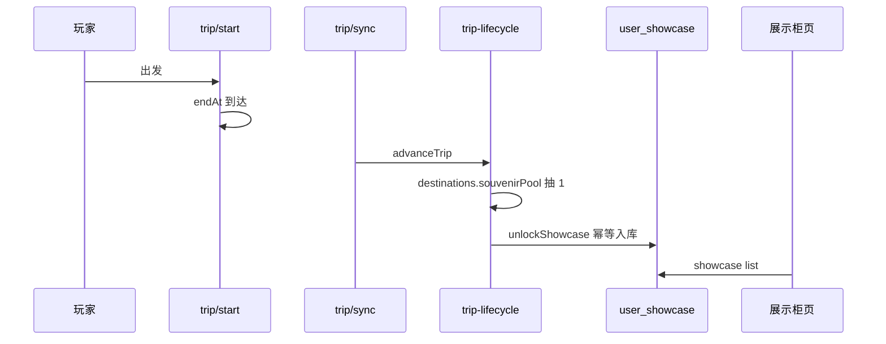

# 后端存储与数据提取审计

> 审计日期：2026-09-02  
> 范围：云数据库集合、云函数读写、小程序 services 层数据提取  
> 重点：**日记**（`user_postcards`）与**展示柜**（`user_showcase`）

---

## 1. 架构总览

```
微信小程序
  └─ services/*.ts（call 云函数）
       └─ cloud/functions/*
            └─ 云数据库集合
```

| 原则 | 说明 |
|------|------|
| 权限 | 客户端不直读写库，全部经云函数 |
| 身份键 | 各集合 `userId` 字段实际存的是微信 **openid**（非 users 表里的 UUID `userId`） |
| 设置页显示 | `settings-modal` 展示的是 UUID `userId`，与库内 `userId` 字段不同，查库请用 openid |
| 图片路径 | 库内存相对路径（如 `postcards/letter-1`），前端须解析为 `/assets/...@{2x\|3x}.webp` |

---

## 2. 集合与云函数对照

| 集合 | 用途 | 写入来源 | 读取云函数 |
|------|------|----------|------------|
| `users` | 星星、米字星、pity、currentTripId | login | login, shop, trip, roof, gacha… |
| `user_inventory` | 背包数量 | shop购买, trip消耗 | inventory/list, trip/start |
| `user_showcase` | 展示柜 | trip归来伴手礼 unlockShowcase | showcase/list |
| `user_postcards` | 日记图鉴 | postcard/claim, mail-box自动已读 | postcard/diary |
| `user_gacha` | 扭蛋已获得 | gacha/draw | gacha/catalog |
| `trips` | 旅行+明信片实例 | trip/start | trip/sync, postcard/mailbox |
| `roof_stars` | 屋顶星星 | roof/sync | roof/sync |
| `daily_purchases` | 每日限购 | shop/purchase | shop/list |
| `items` | 物品配置 | admin/seed | shop, trip, showcase/hydrate |
| `postcards` | 明信片配置 | admin/seed | trip/start 抽样 |
| `destinations` | 目的地 | admin/seed | trip/start |
| `gacha_pool` | 扭蛋奖池 | admin/seed | gacha/draw |
| `idempotency` | 幂等 | shop/trip/gacha | 各写操作 |

---

## 3. 日记数据流（重点）

### 3.1 存储结构 `user_postcards`

```json
{
  "userId": "<openid>",
  "postcardId": "pc_park_duck",
  "title": "公园鸭鸭",
  "rarity": "N",
  "imageThumb": "postcards/letter-1",
  "imageFull": "postcards/letter-1",
  "story": "信件正文…",
  "firstClaimedAt": 1735689600000,
  "claimCount": 1
}
```

- **唯一键**：`userId + postcardId`（同一明信片只解锁一次图鉴，重复收取只 `claimCount++`）
- **排序**：`firstClaimedAt` 升序（获取时间）

### 3.2 写入路径

| 场景 | 云函数 | 逻辑 |
|------|--------|------|
| 玩家主动收下 | `postcard` → `claim` | trips 内明信片 `delivered→claimed`，写入/更新 `user_postcards` |
| 信箱超 5 封自动已读 | `mail-box.collectAndTrimUnread` | 最早信件 `autoReadCard` → `upsertDiaryEntry` |
| 旅行抽样 | `trip/start` | 明信片快照写入 `trips.postcards[]`（含 image/story），**尚未**进日记 |

### 3.3 读取路径

```
pages/diary/index.ts
  → services/diary.ts → listDiary()
  → cloud postcard { action: 'diary' }
  → db.user_postcards.where({ userId: openid }).orderBy('firstClaimedAt', 'asc')
```

### 3.4 信箱中间态 `trips.postcards[]`

```json
{
  "instanceId": "tpm_xxx",
  "postcardId": "pc_park_duck",
  "status": "pending | delivered | claimed",
  "deliverAt": 1735689600000,
  "title": "…",
  "imageThumb": "postcards/letter-1",
  "imageFull": "postcards/letter-1",
  "story": "…",
  "isNew": true
}
```

- `pending`：途中，未到 `deliverAt`
- `delivered`：已投递，出现在鸽子信箱（最多 5 封未读）
- `claimed`：已收下进日记

### 3.5 日记审计结论

| 项 | 状态 | 说明 |
|----|------|------|
| 去重逻辑 | ✅ 正常 | `userId+postcardId` 唯一，符合「同一 postcardId 只解锁一次」 |
| 排序 | ✅ 正常 | 按 `firstClaimedAt` 升序 |
| 超容自动已读 | ✅ 正常 | >5 封时最早信自动 claimed + 写日记 |
| 图片路径解析 | ⚠️ **已修复** | 原先直接用库内相对路径，图片无法显示；现 `resolve-dynamic-asset.ts` 解析 |
| 本地缓存 | ⚠️ **已修复** | 原先云失败返回 `[]`；现 `lxxs_diary_local` 缓存 + claim 后合并 |
| claim 返回值 | ⚠️ **已修复** | 云函数补充返回 `imageThumb` |

---

## 4. 展示柜数据流（重点）

### 4.1 存储结构 `user_showcase`

```json
{
  "userId": "<openid>",
  "itemId": "souvenir_potato",
  "name": "狼牙土豆",
  "icon": "items/souvenir/yizhuan",
  "description": "…",
  "obtainedAt": 1735689600000,
  "source": "trip",
  "createdAt": 1735689600000
}
```

- **唯一键**：`userId + itemId`（幂等，不重复入库）
- **排序**：`obtainedAt` 升序
- **必建索引**：`userId + obtainedAt`（`orderBy` 用）

### 4.2 写入路径

| 场景 | 来源 | 条件 |
|------|------|------|
| 旅行归来伴手礼 | `trip-lifecycle.advanceTrip` | 到期 `traveling→returned`，从 `destinations.souvenirPool` 抽 1 件 |
| GM/Admin 发放 | `admin` → `unlockShowcase` | 手动 |
| 客户端调试 | `showcase/unlock` | 需物品 `showcase=true` 或 type=souvenir/accessory/equipment |

**注意**：扭蛋 `gacha/draw` **目前不写** `user_showcase`，只写 `user_gacha`。V1 奖池为食物，与展示柜无关，符合设计。

### 4.3 读取路径

```
pages/showcase/index.ts
  → services/showcase.ts → listShowcase()
  → cloud showcase { action: 'list' }
  → db.user_showcase → hydrate 补全 items 表字段
  → 前端 buildPages：4 层 × 2 格 = 8/页
```

`hydrate`：若行内 `name/icon/description` 为空，回查 `items` 集合补全。

### 4.4 展示柜审计结论

| 项 | 状态 | 说明 |
|----|------|------|
| 入库幂等 | ✅ 正常 | `unlockShowcase` 先查重再 add |
| 旅行伴手礼 | ✅ 正常 | 归来时 `addInventory` + `unlockShowcase` |
| 排序索引 | ⚠️ 需确认 | 无索引时云函数有内存 sort 降级，但应建 `userId+obtainedAt` |
| 空数据误判 | ⚠️ **已修复** | 原先云端返回空数组会 fallback 到本地 demo 数据，掩盖真实空柜 |
| 图片路径解析 | ⚠️ **已修复** | `icon` 相对路径现经 `resolveDynamicAsset` 解析 |
| 本地 demo 数据 | ℹ️ 保留 | 仅云函数**调用失败**时使用，不再因空列表触发 |

---

## 5. 其他模块速查

### 5.1 背包 `user_inventory`

- **写**：`shop/purchase` +1；`trip/start` 消耗；`trip-lifecycle` 伴手礼 +1
- **读**：`inventory/list` → join `items` 表返回 name/icon/description
- **前端**：`fetchOwned` 成功后同步到 `lxxs_inventory_local`

### 5.2 屋顶星星 `roof_stars`

- **写/读**：`roof/sync` + `roof/collect`
- 每用户独立文档，按 `userId(openid)` + `status` 查询

### 5.3 扭蛋 `user_gacha`

- **写**：`gacha/draw` 非重复奖品
- **读**：`gacha/catalog`
- **缺口**：抽中食物**未**写入 `user_inventory`（V1 奖池独立，若未来食物要进背包需补 `addInventory`）

### 5.4 商店 `daily_purchases`

- 按 `userId(openid) + itemId + dayKey(UTC+8)` 限购 1

### 5.5 旅行 `trips`

- `start`：一次性服务端抽样目的地/时长/明信片
- `sync`：推进明信片投递、到期归来、发伴手礼
- `claimHome`：`returned → at_home`，清空 `users.currentTripId`

---

## 6. 端到端链路图

### 明信片 → 日记



### 旅行 → 展示柜



---

## 7. 问题清单与修复状态

| 严重度 | 问题 | 影响 | 状态 |
|--------|------|------|------|
| 🔴 高 | 日记/展示柜/信箱图片用库内相对路径未解析 | 有数据但图片不显示 | ✅ 已修复 `resolve-dynamic-asset.ts` |
| 🔴 高 | 展示柜云端空列表 fallback 到 demo | review 时看不到真实空态 | ✅ 已修复 `showcase.ts` |
| 🟡 中 | 日记云失败返回空数组 | 离线/云异常时日记空白 | ✅ 已修复本地缓存 |
| 🟡 中 | claim 未返回 imageThumb | 缓存缺缩略图 | ✅ 已修复云函数 |
| 🟡 中 | `userId` 字段名混用 openid/UUID | 查库/对账易混淆 | 📋 文档说明，暂不重构 |
| 🟢 低 | 扭蛋食物未入背包 | V1 设计独立，暂不影响 | 📋 待 V2 |
| 🟢 低 | gacha_pool seed icon 为空 | 扭蛋 UI 无物品图 | 📋 待美术补图 |

---

## 8. 上线前检查清单

### 云数据库

- [ ] 18 个集合已创建（见 `cloud/CLOUD-SETUP.md`）
- [ ] `user_showcase` 索引：`userId↑, itemId↑`（唯一）、`userId↑, obtainedAt↑`
- [ ] `user_postcards` 索引：`userId↑, postcardId↑`（唯一）
- [ ] `user_inventory` 索引：`userId↑, itemId↑`（唯一）
- [ ] seed 已导入：`trip-catalog.json`（items/destinations/postcards）、`gacha-pool.json`

### 云函数

- [ ] `login`, `postcard`, `showcase`, `trip`, `inventory`, `shop`, `roof`, `gacha` 已部署
- [ ] `postcard` 含最新 `claim` 返回 `imageThumb`

### 联调验证

- [ ] 旅行结束 → `user_showcase` 新增 1 条 souvenir
- [ ] 信箱收下 → `user_postcards` 新增，日记页可见且图片正常
- [ ] 第 6 封信 → 最早信自动进日记，信箱仍 ≤5
- [ ] 展示柜空态：新用户显示空格子，**不**出现 demo 狼牙土豆（云已连通时）
- [ ] 同一 `postcardId` 重复 claim 只增加 `claimCount`，日记不重复格

---

## 9. 相关文件索引

| 类型 | 路径 |
|------|------|
| 日记 service | `miniprogram/services/diary.ts` |
| 展示柜 service | `miniprogram/services/showcase.ts` |
| 信箱 service | `miniprogram/services/postcard.ts` |
| 图片路径解析 | `miniprogram/utils/resolve-dynamic-asset.ts` |
| 明信片云函数 | `cloud/functions/postcard/index.js` |
| 展示柜云函数 | `cloud/functions/showcase/index.js` |
| 展示柜入库 | `cloud/functions/common/showcase.js` |
| 信箱逻辑 | `cloud/functions/common/mail-box.js` |
| 旅行推进 | `cloud/functions/common/trip-lifecycle.js` |
| 集合说明 | `cloud/collections.md` |
| 云端配置 | `cloud/CLOUD-SETUP.md` |
